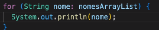
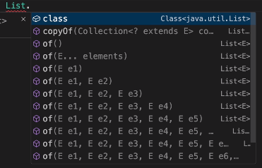

# Trabalhando com Collections

## Referência: Curso de Desenvolvimento Java, Giuliana Silva Bezerra
[Compre aqui](https://www.udemy.com/course/curso-de-desenvolvimento-java/)
<hr>

## Tópicos

- [Arrays vs Collections](#arrays-vs-collections)
- [Declarando uma ArrayList](#declarando-um-arraylist)
- [Adicionando Elementos no ArrayList](#adicionando-elementos-no-arraylist)
- [Get no ArrayList](#get-no-arraylist)
- [Insert e Update no ArrayList](#insert-e-update-no-arraylist)
- [Delete no ArrayList](#delete-no-arraylist)
- [Sort no ArrayList](#sort-no-arraylit)
- [Percorrendo ArrayList - For vs Iterator](#percorrendo-um-arraylist---for-vs-iterator)
- [Conversão entre Array e ArrayList](#conversão-entre-array-e-arraylist)
- [Map e Hashmap](#map-e-hashmap)
  - [Adicionando Elementos](#como-adicionar-elementos-no-map)
  - [Recuperando Elementos](#como-recuperar-elementos-no-map)
  - [Atualizando Elementos](#como-atualizar-elementos-no-map)
  - [Removendo Elementos](#como-remover-elementos-no-map)
  - [Iterando pelo Map](#como-iterar-sobre-todos-elementos-no-map)

<hr>

## Arrays vs Collections

Já sabemos que para iniciar uma Array, fazemos dessa forma:
```java
String[] nomes = new String[3];

//ou

String[] nomes = {"Giuliana", "Leia", "Rey"};
```

O problema dos Arrays, é que a gente define o tamanho deles. Muita das vezes a gente não sabe o tamanho dos arrays.

Para vencer essa limitação de tamanho fixo, usamos **Collections**, como o **ArrayList**.

```java
import java.util.ArrayList;

ArrayList<String> nomesArrayList = new ArrayList<>();
```

Passamos dentro do ``<>`` o tipo do array e iniciamos com o construtor. Não precisa, portanto, informar o tamanho
desse Array. **Ele é criado por padrão, com tamanho 10.**
<hr>

## Declarando um ArrayList

O ArrayList implementa ``List<>``. Ele é, portanto, um array e uma lista. :)

Nós podemos usar no Array, propriedades específicas da lista, por exemplo:

```java
import java.util.ArrayList;
import java.util.List;

List<String> nomesArrayList = new ArrayList<>();
// iniciamos essa List com o ArrayList. (Tipo mais concreto).
```
<hr>

## Adicionando Elementos no ArrayList

Para colocar valores dentro do array, usamos ``.add``, veja:
```java
import java.util.ArrayList;
import java.util.List;

List<String> nomesArrayList = new ArrayList<>();
nomesArrayList.add("1")
nomesArrayList.add("2")
```

Podemos iniciar esses ``.add``, dentro da propria inicialização do ArrayList:
```java
import java.util.ArrayList;
import java.util.List;

List<String> nomesArrayList = new ArrayList<>() {{
    add("1");
    add("2");
    // não precisa passar o nome do list dentro do {}, pois estamos referenciando a  
    // variável usando o ".this", internamente.
}};
```
<hr>

## Get no ArrayList
Para obtermos um elemento do ArrayList, basta usar ``.get(index)`` passando o index desejado dentro.

```java
nomesArrayList.get(0);
```
<hr>

## Insert e Update no ArrayList

Para inserimos e atualizamos um elemento do ArrayList em posições específicas, usamos o ``.set()``.

```java
nomesArrayList.set(0, "1");
//passamos o index desejado a ser substituido, e depois o que queremos substituir.
```

**Não podemos passar no ``.set``, uma posição maior que o tamanho atual da Array!**
<hr>

## Delete no ArrayList

Para deletarmos um elemento do ArrayList, basta utilizar ``.remove``.

```java
//podemos remover com o indíce
nomesArrayList.remove(1);

//ou remover passando o objeto em sí (como ele está declarado dentro da Array).
nomesArrayList.remove("1");
```
<hr>

## Sort no ArrayLit

Muitas vezes precisamos trabalhar com uma lista ordenada, para fazermos calculos específicos, por exemplo.

Para isso, utilizamos ``.sort()``. 

**Se for String, ele colocará em ordem alfabética. Se for número, em ordem crescente.**

```java
import java.util.Collection;

Collection.sort(nomesArrayList);
```
<hr>

## Percorrendo um ArrayList - For vs Iterator

A gente já sabe fazer isso com o for (usando forEach).



Mas podemos iretar com os "iterators".

```java
import java.util.Iterator;
//precisamos passar o tipo de Array, pois é um método genérico.
Iterator<String> it = nomesArrayList.iterator();

while (it.hasNext()) {
    String itemAtual = it.next();
    System.out.println(itemAtual);
}
```

Esse ``it``, possui um método ``hasNext()``, que funcionará como um "ponteiro", percorrendo da esquerda para direita.
E enquanto tiver um next (um item), ele continuará iterando.
<hr>

## Conversão entre Array e ArrayList

O List possui alguns métodos estáticos que podemos utilizar. Se usarmos ``List.`` irá aparecer váários métodos:



Nós podemos, portanto, criar uma lista a partir de vários elementos.

```java
import java.util.List;

List<String> listaDeNomes = List.of("Giuliana", "Leia", "Rey");
System.out.println(listaDeNomes);
```

Podemos criar uma lista a partir de Arrays também!

```java
import java.util.Arrays;
import java.util.List;

String[] arrayDeNomes = {"Giuliana", "Leia", "Rey"};

//convertendo para lista:
List<String> listaConvertida = Arrays.asList(arrayDeNomes);
System.out.println(listaConvertida);
```

**E de Lista para Array?**

Lists tem um método chamado ``toArray()``, ele vai retornar um array de objetos, veja:

```java
import java.util.Arrays;
import java.util.List;

//precisamos iniciar com new String para que ele saiba o tipo de objeto a retornar
// e um tamanho padrão também.
String[] arrayConvertido = listaConvertida.toArray(new String([0]));
System.out.println(Arrays.toString(arrayConvertido));
```
<hr>

## Map e HashMap

Existe também um tipo de coleção para salvar um conjunto de identificador (key) e valor (value), 
ele chama-se Map.

``Map<K,V>`` - K para chave e V para valor.

Imagine que queremos guardar uma lista de usuário onde a **chave é o Username** e o **valor o nome dele**.

Será um:

```java
import java.util.HashMap;

Map<String, String> mapaDeUsuarios = new HashMap<>();
```

### Como adicionar elementos no Map?
Para inicializar o HashMap é semelhante à lista, mas agora é ``put``, informando chave e valor.
```java
import java.util.HashMap;

Map<String, String> mapaDeUsuarios = new HashMap<>();
mapaDeUsuarios.put("giuliana", "Giuliana");
mapaDeUsuarios.put("leia", "Leia");
```

E assim como lá em cima, podemos inicializar também direto na declaração.
```java
import java.util.HashMap;

Map<String, String> mapaDeUsuarios = new HashMap<>() {{
    put("giuliana", "Giuliana");
    put("leia", "Leia");
}};
System.out.println(mapaDeUsuarios);
```

### Como recuperar elementos no Map?

Usamos o ``get``, passando a chave:
```java
import java.util.HashMap;

Map<String, String> mapaDeUsuarios = new HashMap<>();
mapaDeUsuarios.get("valorDaChave");
```

### Como atualizar elementos no Map?

Usamos o ``put``. A diferença do put ali pra cima, é que se passarmos uma chave que já existe,
ele vai substituir o valor.

```java
import java.util.HashMap;

Map<String, String> mapaDeUsuarios = new HashMap<>();
mapaDeUsuario.put("chaveASerSubstituida", "valorSubstituido");
```

### Como remover elementos no Map?

Usamos o ``remove``, que recebemos a chave que queremos remover.

```java
import java.util.HashMap;

Map<String, String> mapaDeUsuarios = new HashMap<>();
mapaDeUsuario.remove("chaveASerRemovida");
```

### Como iterar sobre todos elementos no Map?

Se não temos índice, como fazer? Iremos iterar pelo for, mas agora com os **valores** que temos no mapa.

```java
//o values transforma o Map em uma Collection
for (String valores : mapaDeUsuarios.values()) {
    System.out.println(valores);
}
```

Pode ser feito um for percorrendo as chaves também!
```java
//keySet retorna um conjunto de chaves que é possivel percorre-lo
for (String chaves : mapaDeUsuarios.keySet()) {
    System.out.println(valores);
}
```


